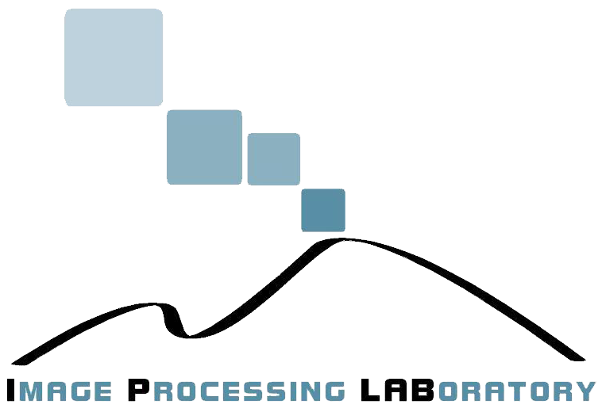

<div style="text-align:center">
<a href="http://www.dmi.unict.it/"></a>
<a style="margin-left:2%" href="http://www.unica.it/"></a>
<a style="margin-left:2%" href="https://www.ictlab.srl/"></a>
<a href="https://iplab.dmi.unict.it/"></a>
</div>
<br><br>

<h1  style="font-family: Arial;  font-size: 40px;"><b>Computational data analysis for first quantization estimation on JPEG double compressed images</b></h1>

<div style="font-size:15px; color:black"><b><a href="https://www.micc.unifi.it/icpr2020/" target="_blank">In Proceedings of the International Conference on Pattern Recognition</a></b></div>
<br>

<div style="font-size:15px; color:black"><b>Sebastiano Battiato<sup>1,2</sup>, Oliver Giudice<sup>2,3</sup>, Francesco Guarnera<sup>1,2</sup>, Giovanni Puglisi<sup>4</sup></b></div>
<br>
<div style="font-size:12px; color:black"><sup><b>1</b></sup> <em>Department of Mathematics and Computer Science, University of Catania, Viale Andrea Doria 6, Catania 95125, Italy</em><br>
	<sup><b>2</b></sup> <em>iCTLab s.r.l. Spinoff of University of Catania, Italy</em><br>
	<sup><b>3</b></sup> <em>Banca d'Italia, Rome, Italy</em><br>
	<sup><b>4</b></sup> <em>Department of Mathematics and Computer Science, University of Cagliari, Via Ospedale 72, Cagliari 09124, Italy</em><br>
	<br>
	<b>battiato@dmi.unict.it, oliver.giudice@bancaditalia.it, francesco.guarnera@unict.it, puglisi@unica.it</b>
	<br><br>
</div>
<div style="text-align: center; background-color: cornsilk; border-radius: 10px;margin-left: 20%;margin-right: 20%;width: 60%">

<center>
<a href="https://ieeexplore.ieee.org/document/9412528"><font size="5px" ><b>DOWNLOAD PAPER</b></font></a>
</center>
<br><br>
<div style="text-align:left !important;margin-left:20%">
	@article{battiato2021computational,<br>
<span style="margin-left: 2%">title={Computational data analysis for first quantization estimation on JPEG double compressed images},</span><br>
<span style="margin-left: 2%">author={Battiato, Sebastiano and Giudice, Oliver and Guarnera, Francesco and Puglisi, Giovanni},</span><br>
<span style="margin-left: 2%">booktitle={2020 25th International Conference on Pattern Recognition (ICPR)},</span><br>
<span style="margin-left: 2%">pages={5951--5958}</span><br>
<span style="margin-left: 2%">year={2021}</span><br>
<span style="margin-left: 2%">organization = {IEEE}</span><br>
	}
</div>

<br><br>

# JPEG First Quantization Estimation 

This program is free software: it is distributed WITHOUT ANY WARRANTY.

If you are using this software, please cite:

Battiato, Sebastiano and Giudice, Oliver and Guarnera, Francesco and Puglisi, Giovanni:
“Computational data analysis for first quantization estimation on JPEG double compressed images",
In Proceedings of the International Conference on Pattern Recognition, 2021
    
The software estimates the first 15 quantization factors (in zig-zag order) of an aligned Double compressed JPEG image.

Given the double JPEG compressed image <b>I</b>, the software read the second quantization matrix <b>Q2</b> from <b>I</b> and it simulate all possible double compressions 
employing a constant matrix for each value between 1 and <b>max</b> (set inside the file v1.py) for the first compression and <b>Q2</b> for the second one.

128_128.jpg: 128X128 image compressed with QF1=60 e QF2=90

4288_2848.jpg: 4288X2484 image compressed with QF1=60 e QF2=90

The JPEG files (128_128.jpg and 4288_2848.jpg) have the first 15 quantization factors (in zig-zag order) equal to [13, 9, 10, 11, 10, 8, 13, 11, 10, 11, 14, 14, 13, 15, 19]

v1.py: python file to predict the quantization factor (function get_coefficients_first_compression in the main).

jpeg: executable file for DCT values extraction from file (without IDCT); it needs the executable permissions.


We tested our codes on Python 2.7 and Python 3 under Ubuntu 16.04 and 18.04 (64 bit).

<br>

## Try the code

The libraries needed to execute the code are:
```
sys
numpy
PIL
subprocess
os
```


To try our software, execute:
```
python3 -v1.py
python -v1.py
```


